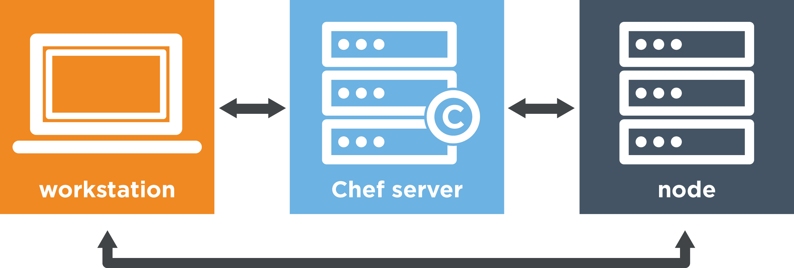

# The Chef Bootcamp
> This was taken from learn chef rally and just modified for simplicity
##Learn the Chef basics 

After completing this module, you should be able to:

- describe what happens when Chef runs.
- write Chef code that defines a basic policy.
- apply that policy to a server.

### Chef Workflow
Draw the Chef workflow



What is a node?
> A node is any computer that is managed by a Chef server.

What is the Chef Workstation?
> You use this to write and verify your configuration policy by writing Chef code.

Explain the workflow
> - You write config policy
> - You upload your Chef code to the Chef server 
> - You run Chef client on your node.
> - Node downloads latest code from Chef server 
> - Node runs code

What is Chef Automate
>includes a Chef server, provides automated build pipelines that enable you to deliver apps faster.

### Launch EC2

Launch an EC2 instance
Download pem
```
$ chmod 400 ~/.ssh/chef-test.pem
```
SSH into the instance
```
$ ssh -i ~/.ssh/chef-test.pem ubuntu@ec2-54-166-245-105.compute-1.amazonaws.com
```

 Ensure your sg inbound traffic is open fort ports `22` (SSH), `80` (HTTP), and `443` (HTTPS) 

Update apt `cache` and install `curl`
```
$ sudo apt-get update
$ sudo apt-get -y install curl
```

Install Chef Workstation
```
$ curl https://omnitruck.chef.io/install.sh | sudo bash -s -- -P chef-workstation -c stable -v 0.2.41
```

What is Chef Workstation
> Chef Workstation provides tools that enable you to manage your servers remotely from your workstation. But it also provides tools that allow you to configure a machine directly.

```
$ sudo apt-get install vim --yes
```

### Configure a resource
What is a resource?
> 	
A Chef resource describes one part of the system, such as a file, a template, or a package. Describe desired state of the system.

What is a recipe?
>  A Chef recipe is a file that groups related resources, such as everything needed to configure a web server, database server, or a load balancer.

Setup your working directory
```
$ mkdir ~/chef-repo
$ cd ~/chef-repo
```

Create a recipe file `hello.rb`
```
$ vi hello.rb
```
Describe the desired state of the file
```
file '/tmp/motd' do
  content 'hello world'
end
```
Apply the chef code in local mode
```
chef-client --local-mode hello.rb
```
What is local mode
> Local mode is a way to run the chef-client against the chef-repo on a local machine as if it were running against the Chef server.

Verify the files were written
```
$ more /tmp/motd
```
Change the desired state 
```
$ vi hello.rb
```
```
file '/tmp/motd' do
  content 'kamusta mundo'
end
```
```
$ chef-client --local-mode hello.rb
```
Delete file using resource
```
file '/tmp/motd' do
  action :delete
end
```
Explain: "Resources describe the what, not the how"
> A recipe is a file that holds one or more resources. Each resource declares what state a part of the system should be in, but not how to get there. Chef handles these complexities for you.''

### Configure a package and service
What are files and packages
> Like files, packages and services are also types of resources. Chef applies resources in the order you specify.

Add `webserver.rb`
```
$ vi webserver.rb
```
Ensure apt cache is up to date
```
apt_update 'Update the apt cache daily' do
  frequency 86_400
  action :periodic
end
```
Install apache package
```
package 'apache2'
```
> no action specified because install is default

Start and enable the Apache service
```
service 'apache2' do
  supports status: true
  action [:enable, :start]
end
```
> Ubuntu 14.04 provides two init systems. The supports status: true part tells Chef that the apache2 init script supports the status message. This information helps Chef use the appropriate strategy to determine if the apache2 service is running. If you're interested

Add a home page 
```
file '/var/www/html/index.html' do
  content '<html>
  <body>
    <h1>hello world</h1>
  </body>
</html>'
end
```
Confirm your web site is running
```
$ curl localhost
```
### Make your recipe more manageable
Create a cookbook
```
$ ~/chef-repo
$ mkdir cookbooks
```
```
$ chef generate cookbook cookbooks/learn_chef_apache2
```
Install tree 
```
$ sudo apt-get tree
```
Run the cookbook
```
$ sudo chef-client --local-mode --runlist 'recipe[learn_chef_apache2]'
```
What is test and repair
> Chef applies changes only when they are necessary.
What is a run list
> A run-list specifies which recipes to run and the order in which to run them.
What does a cookbook do
> It includes recipes and external information and makes them easier to manage.


